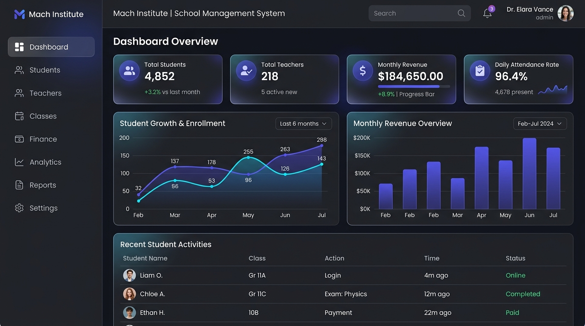
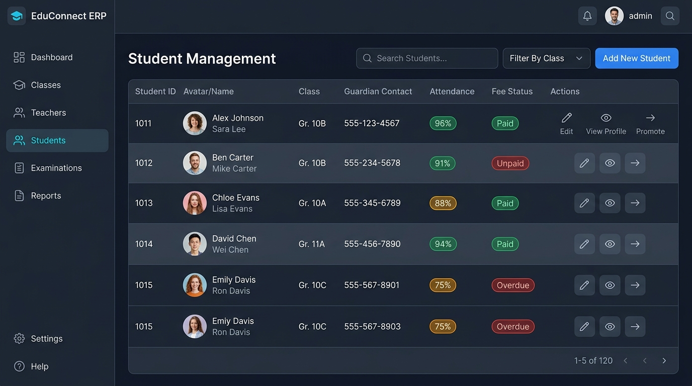

# 🎓 Machad Management System (Mach ERP)

[](https://vitejs.dev/)
[](https://reactjs.org/)
[](https://nodejs.org/)
[](https://www.mongodb.com/)
[](https://tailwindcss.com/)
[](https://vercel.com/)

**Machad Management System** waa nidaam casri ah oo loogu talagalay maamulka dugsiyada, jaamacadaha, iyo xarumaha waxbarashada (School & Institute ERP). Nidaamku wuxuu si hufan isugu xiraa maamulka waxbarashada, xisaabaadka maaliyadda, xaadirinta, imtixaanaadka, iyo warbixinada muhiimka ah.

---

## 📸 Muuqaalka Guud ee Nidaamka (Dashboard Overview)



---

## ✨ Tilmaamaha Ugu Waaweyn (Key Features)

### 1. 🎓 Maamulka Waxbarashada (Academic Management)
* **Classes & Sections**: Diiwaangelinta, maamulka fasalada, xilliyada, iyo qaybaha kala duwan.
* **Students Management**: Diiwaanka ardayda, xogta shakhsiga ah, waalidiinta (Guardians), iyo heerarka waxbarasho.
* **Teachers & Staff**: Maamulka macalimiinta, maadooyinka ay dhigaan, iyo xiriirkooda.
* **Class Promotion**: Ardayda oo hal fasal looga dallacsiiyo fasal kale dhammaadka sanad-dugsiyeedka.



---

### 2. 💰 Maaliyadda & Xisaabaadka (Finance & Cashbook)
* **Cashbook Ledger**: Buugga xisaabta maalinlaha ah oo diiwaangeliya dakhliga (Income) iyo kharashaadka (Expenses).
* **Tuition Fees & Payments**: Qaadista fiiga billaha ah ee ardayda, risiidhada, iyo raadraaca kuwa aan bixin.
* **Wallets & Accounts**: Maamulka akoonnada kala duwan (Bankiyo, Kaash, EVC Plus / Mobile Money).
* **Salaries**: Xisaabinta iyo bixinta mushaarka macalimiinta iyo shaqaalaha.
* **Export & Print**: Soo saarista warbixinada maaliyadda ee qaababka PDF iyo Excel.


---

### 3. 📅 Xaadirinta Maalinlaha ah (Daily Attendance)
* **Student Attendance**: Xaadirinta maalin kasta (Jooga, Maqan, Cudurdaar).
* **Teacher Attendance**: La socodka imaanshaha macalimiinta iyo shaqaalaha.
* **Attendance Ledger**: Warbixino joogto ah oo lagu xisaabinayo boqolleyda imaanshaha fasal kasta.

---

### 4. 📝 Imtixaanaadka & Dhibcaha (Examinations & Results)
* Sameynta jadwalka imtixaanaadka (Midterm, Final Exams).
* Gelinta dhibcaha arday kasta iyo maaddo kasta (Mark Entry).
* Soo saarista warqadda natiijada ardayga (Student Report Card) iyo kala sarreynta kaalmaha.

---

### 5. 🛡️ Amniga & Doorka Isticmaalayaasha (RBAC Security)
* **Super Admin**: Awood buuxda oo nidaamka oo dhan ah.
* **Institute Admin**: Maamulaha guud ee xarunta.
* **Branch Manager**: Maamulaha laanta gaarka ah.
* **Accountant**: Mas'uulka xisaabaadka iyo qasnadda.
* **Teacher**: Gelinta xaadirinta iyo dhibcaha maaddooyinka.
* **Activity Logs**: Diiwaanka ficillada la sameeyo si loola socdo amniga xogta.

---

## 🛠️ Qalabka Lagu Dhisay (Tech Stack)

| Qaybta | Tiknoolajiyadda |
| :--- | :--- |
| **Frontend** | React 19, Vite, TailwindCSS, React Router, Recharts, Lucide Icons |
| **Backend** | Node.js, Express.js, REST API, Mongoose |
| **Database** | MongoDB Atlas / Local MongoDB |
| **Security** | JWT (JSON Web Tokens), Bcrypt.js Password Hashing |
| **Documents** | jsPDF, ExcelJS, PDFKit |
| **Deployment** | Vercel (Frontend), Node/Render/Railway (Backend) |

---

## 🚀 Sida Loo Kiciyo (Getting Started Locally)

### 1. Soo Degso Mashruuca (Clone Repository)
```bash
git clone https://github.com/salaaxudaareyn81-tech/salaaxu-aldareyn.git
cd salaaxu-aldareyn
```

### 2. Kici Backend-ka (Server)
```bash
cd Backend
npm install
npm start
```
*Server-ku wuxuu ku shaqaynayaa Port `5005`.*

### 3. Kici Frontend-ka (Client)
Fur daaqad labaad oo terminal ah:
```bash
cd Frontend
npm install
npm start
```
*Ka fur browser-kaaga cinwaanka: `http://localhost:5173`*

---

## 🌐 Sida Vercel Loogu Saaro (Deploying on Vercel)

Mashruucani wuxuu horey u leeyahay habaynta [`vercel.json`](vercel.json):

1. Gal [Vercel.com](https://vercel.com) oo ku gal akoonkaaga GitHub.
2. Guji **Add New...** ➔ **Project**.
3. Dooro repository-ga **`salaaxu-aldareyn`** ka dibna guji **Import**.
4. Guji **Deploy** — nidaamku si toos ah ayuu u dhismi doonaa!

---

## 🔑 Xogta Galitaanka Ugu Horraysa (Default Credentials)

* **Email**: `admin@machad.edu`
* **Password**: `Machad!Admin2026#` *(ama `123456`)*

---

## 📂 Qaab-dhismeedka Mashruuca (Folder Structure)

```text
├── Backend/                 # Server-ka Node.js & Express.js
│   ├── src/
│   │   ├── controllers/     # Maamulka logic-ka xogta
│   │   ├── models/          # MongoDB Mongoose Schemas
│   │   ├── routes/          # API Endpoints
│   │   └── index.js         # Entry point-ka Server-ka
├── Frontend/                # Dhinaca UI-ga ee React + Vite
│   ├── src/
│   │   ├── components/      # UI Components (Sidebar, Navbar, Cards)
│   │   ├── pages/           # Shaashadaha nidaamka (Students, Finance, etc.)
│   │   ├── services/        # Axios API Client
│   │   └── App.jsx          # Routing & Navigation Guard
├── docs/
│   └── images/              # Sawirrada iyo Mockups-ka README-ga
├── vercel.json              # Vercel Deployment Configuration
└── package.json             # Root scripts
```

---

## 📄 License & Xuquuqda
Dhammaan xuquuqda waxay u dhawran yihiin **Machad Management System**.

